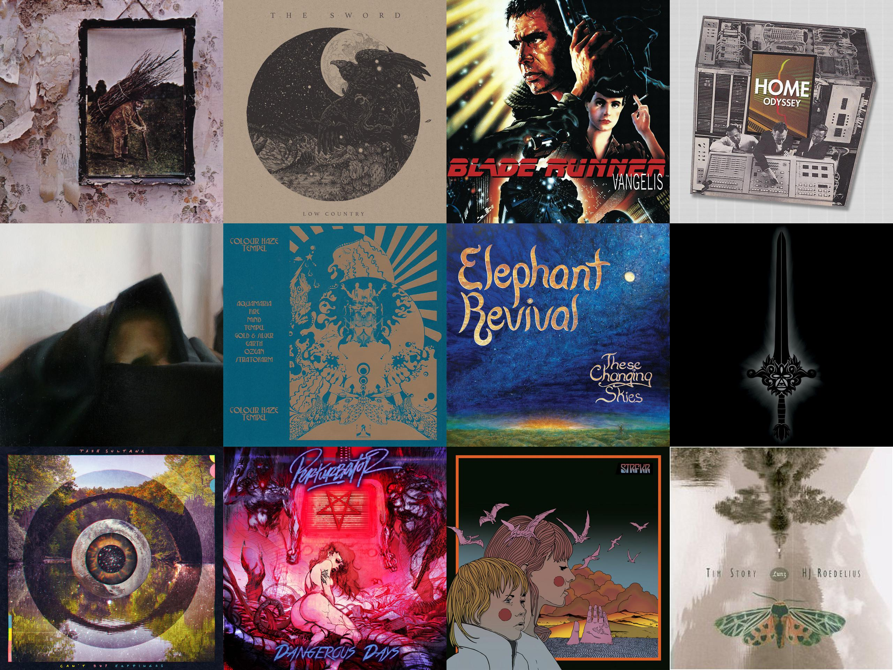

# spotify\_collage
`spotify_collage` provides a simple method of retrieving all unique album art from either a Spotify playlist or artist on Spotify and creating a collage from the query.

## Installation:
```bash
git clone https://github.com/orioncrocker/spotify_images
```

## Setup:
Before using this program, you'll need to get credentials from [Spotify's API](https://developer.spotify.com/documentation/web-api/quick-start/). An account on Spotify will provide two credentials: 'client id' and 'client secret.' In order to use your own credentials, you will have to create a file named `config.py.` A file name `your_config.py` has been provided for you to modify.

Your `config.py` file should have these two fields:
```python
client_id = 'your client id'
client_secret = 'your client secret'
```

Two prerequisites you'll need installed on your machine are pillow and spotipy.
You can easily get both of these from the `pip` repository.
If you aren't yet aware of the beauty of `pip`, go check out [it's website](https://pypi.org/project/pip/).
You're welcome.

```bash
pip3 install -r requirements.txt
```

# Usage:

## Get all album art from an artist:
Download all album artwork from a specific artist on Spotify by using the `-a` command for `--artist`.
```bash
python3 main.py -a https://open.spotify.com/artist/6irKXFXk2sPNmHtKqmrfuU
11 saved to results/unleash_the_archers
```
Keep in mind there are a LOT bands on Spotify, and sometimes the specific artist you're looking for shares a name with another group.
Because of this, a more precise way of obtaining album artwork is through the playlist method.

## Get all album art from a playlist:
Download all unique artwork from a specific playlist on Spotify.
Provide either the URL or URI to the argument `-p` for `--playlist`.
```bash
python3 main.py -p https://open.spotify.com/playlist/6urXF25l3Hr2S4crKwF3L0
18 saved to results/night_drive
```

## Create a collage from a playlist or artist artwork
Neither of the previous examples took advantage of the `verbose` flag `-v` or `collage` flag `-c`. When using both of these flags, the output will look as such.

```bash
python3 main.py -vca 'Unleash the Archers'
results/unleash_the_archers/apex.jpeg
results/unleash_the_archers/northwest_passage.jpeg
results/unleash_the_archers/demons_of_the_astrowaste.jpeg
results/unleash_the_archers/time_stands_still.jpeg
results/unleash_the_archers/abyss.jpeg
results/unleash_the_archers/heartless_world.jpeg
results/unleash_the_archers/behold_the_devastation.jpeg
results/unleash_the_archers/defy_the_skies.jpeg
results/unleash_the_archers/cleanse_the_bloodlines.jpeg
results/unleash_the_archers/tonight_we_ride.jpeg
results/unleash_the_archers/the_matriarch.jpeg
11 saved to results/unleash_the_archers
Total unique pictures: 11
Rows: 3	Cols: 3
Collage saved as: results/unleash_the_archers.jpeg
```
The resulting collage:

[](https://github.com/orioncrocker/spotify_images/blob/master/examples/collage.jpeg)

To specify the output location and name of a collage file, use the `-o` flag.
```bash
python3 main.py -cp spotify:playlist:1l3ttggvijrdbYX8lsZ7eI -o output
```
```
Collage saved as: output.jpeg
```

There is no need to add a file extension to the name, as the default always saves as a `.jpeg`.

## Planned features:
I would love to be able to specify a width and height for the purposes of creating wallpapers.
Unfortunately this requires more math than my smooth brain can comprehend in a small amount of time.

A website that hosts this code via [Flask](https://flask.palletsprojects.com/en/1.1.x/) 
would be ideal so that anyone could utilize this software without the hassle of installation and configuration.
However if I'm going do that I may as well rewrite the whole darn thing in Javascript and save myself some trouble and headache.
